---

# Introduction

Often, some of the most profound ideas in our lives sound trivial when we first cross paths with them. For me, Gödel's incompleteness theorem demonstrated this par excellence. While I have discussed some of these ideas before, it had only ever been in passing, never expanding on their mystifying implications outside the fields of maths and logic, particularly on the nature and limits of consciousness and creativity. This essay will deal with exactly this subject matter in two parts: firstly, giving the background and mathematics behind Gödel's incompleteness theorem, and secondly, discussing what the implication of these results might be on the nature of the mind. However, before we get into this, I would like to briefly say the following.

I was inspired to write this article after reading Douglas Hofstadter's 1979 Pulitzer Prize winning masterpiece 'Gödel, Escher, Bach: an eternal golden braid', a book I highly encourage you to read if what you learn here sparks your interest. Hofstadter is an author with an unparalleled capacity for imparting deep and technical insight to his readers while interweaving wit, creativity, and playfulness into every atom of his prose. To fully describe the significance and beauty of Gödel's results, he covers an incredibly broad array of subjects, effortlessly leaping from maths to computer science, from molecular biology to Zen Buddhism. To do these ideas the full justice they deserve is a task too large for one article. As a result, while writing this I was very conflicted as to what the minimum amount of information is that I would need to communicate a sufficiently deep understanding of the matters at hand. I've tried my best to keep this article as brief and non-technical as possible, but some level of technicality was needed in the areas where analogy was not up for the task. If mathematics is usually a subject matter that you shy away from, I implore you to trust your intellectual capabilities and press on as this is an idea unique in both beauty and profundity that I believe is as good a testament as any to the inherent value of the pursuit of truth. With this in mind, let us begin.

# Part I

## The state of mathematics

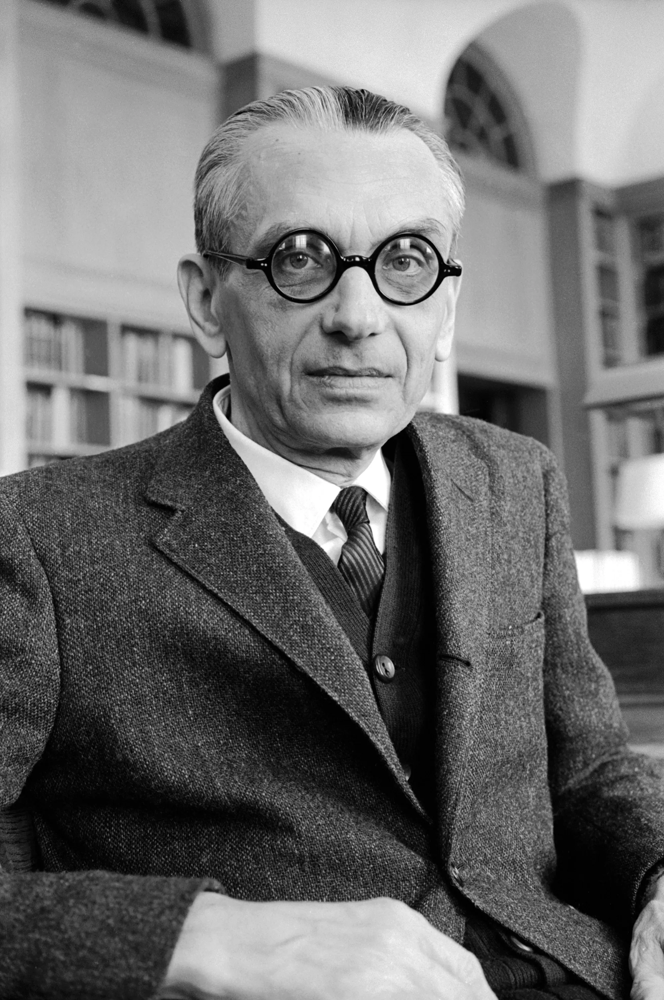

To understand the motivation behind the efforts of Kurt Gödel, it would be prudent to first have a look at the intellectual climate in the years preceding the publication of his theory in 1931. The 19th century saw leaps and bounds in the field of mathematics and the 20th was in no rush to decelerate this trend. At the turn of the century, formalised systems of mathematics and logic were becoming increasingly popular, and also increasingly powerful. There was an optimistic belief that if we could perfectly formalise mathematics, with number theory at its core, we would be able to gain a complete and perfect knowledge of the field, in effect, ending the study of it. As a point of clarification, number theory is simply the branch of mathematics that deals with propositions about the naturals number i.e. 0, 1, 2, 3, etc. Statements such as '6 is an even number', '5 squared equals 25', and 'There are infinite prime numbers' would all belong to number theory. While this may seem like a trivial subject matter for the minds of professional mathematicians, there are still many simply stated number-theoretical problems that have remained unsolved after hundreds of years. Two of the most famous of these are Goldbach's conjecture, which can be stated as follows:

> Every even whole number greater than 2 is the sum of two prime numbers.

and the twin prime conjecture which can also be stated succinctly as the following:

> There are infinitely many twin primes; pairs of primes that differ by 2.

Both of these results have been verified up to exceedingly large numbers, but as for the possibility of general proofs, or even if such proofs are possible, we are none the wiser. It is not only the properties of the natural numbers, but also of the formal systems of number theory themselves which concern mathematicians (or meta-mathematicians in this case). While there are many interesting properties to investigate, two of the most important, which will also be the subject matter of this essay, are completeness and consistency. These are each fairly simple ideas to grasp and can be summarised as follows:

> If a system is complete, all true statements in a given field can be derived from it.

> If a system is consistent, it produces no contradictions.

Why are these desirable qualifications? Imagine some system of number theory that is both consistent and complete. If we are given any number-theoretical proposition, such as the two mentioned above, to verify whether it is true or not, we would no longer need to leverage the minds of mathematicians, but rather merely beseech our formal system, like the oracle at Delphi, if a valid derivation for that statement exists. If it does that statement is true, if it doesn't, it is false. End of discussion. Conversely, we could say the following: if we possessed such a system and left a computer with a knowledge of its rules and restrictions to churn out theorems, we would produce an exhaustive, albeit infinite, list of all true statements of number theory. Needless to say, it is understandable why some of the greatest minds of the generation, Gödel being one of them, made this herculean effort their lives work. Despite the inevitable result of this being lines of mathematicians at the job centre, many had an incurably optimistic view of a future in which we possessed such a tool. They believed humanity would enjoy a new-found power and wisdom from being the proprietors of the ultimate arbiter of truth. Given the still logically ambiguous world, we inhabit today, you might've guessed that this pursuit turned out to be chimeric, and the knockout blow was to be delivered by Kurt Gödel and his eponymous theorem.

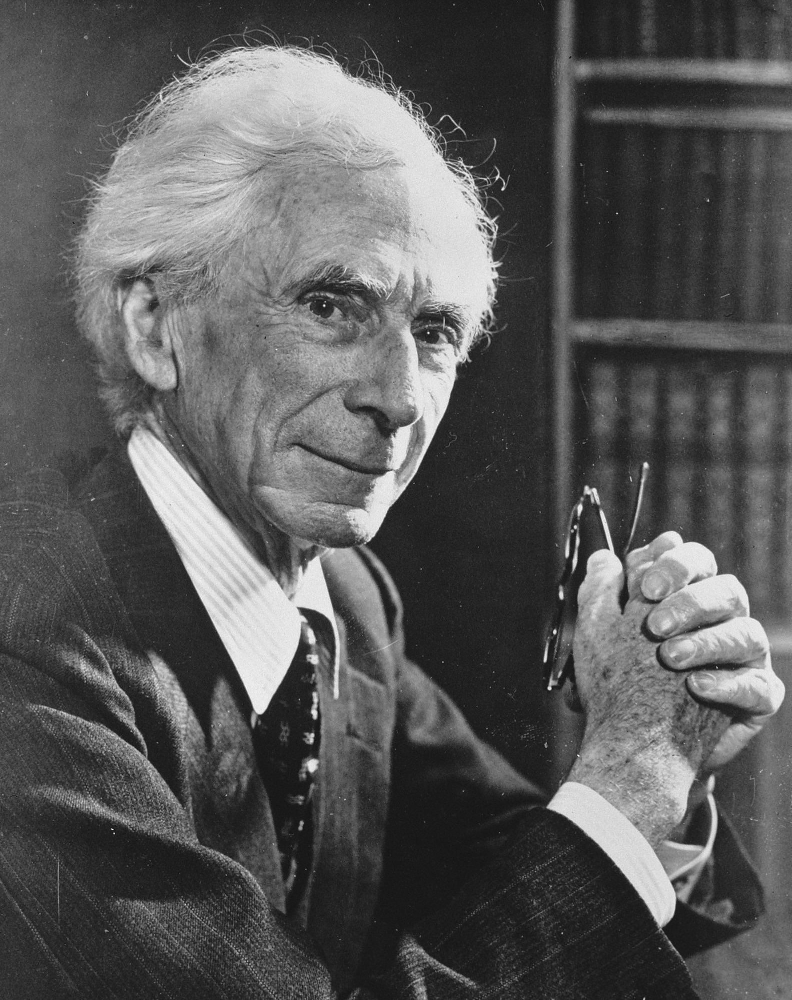

In the championship match for completeness, Gödel's chief opponent was Bertrand Russell, one of the towering intellects of the 20th century and co-author of the three-volume work 'Principia Mathematica', whose final volume was published in 1913. PM was a mammoth effort between himself and Alfred North Whitehead to create a formal system of unprecedented scope and power that, at least they presumed, was to be the last we'd ever need. PM's predecessors had been plagued with logical inconsistencies which, at least in Russell's view, were all rooted in the issue of self-reference, or in other words, the ability for a system to talk about itself. This is an idea at the heart of Gödel's construction that we will revisit at numerous points throughout this essay. The simplest self-referential paradox that we can discuss is known as the Epimenides paradox which can be stated simply as:

> This statement is false.

A few moments of thought should provide some elucidation as to why this proposition is paradoxical. The self-reference here can be traced to the inclusion of the phrase “This statement”, a technique that may seem straightforward, but requires a surprising amount of implicit knowledge on behalf of the reader. The details of this are an interesting discussion in their own right but are not something we will get into here. PM was meticulously crafted to avoid this kind of construction by being built upon a strict hierarchy of 'types', which could only talk about objects of a lower type than themselves along with a host of other restrictions. Funnily enough one of the motivating reasoning for Russell and Whitehead's work was to develop a rigorous proof for the fact that 1+1=2, a proposition that took them 900 pages of dense formal logic to prove. As you can imagine, while it was a milestone for mathematicians, Principia Mathematica isn't the most riveting piece of literature ever produced. For almost two decades Russell and Whitehead believed their efforts to be successful, that is until Gödel demonstrated a brutal fact of reality, that creating a formal system of number theory that is both powerful and incapable of producing self-referential statements is impossible. In fact, it is because of this very power that formal systems are fundamentally and inescapably self-referential, no matter what precautions you take. The reasoning for this is deep and inextricably linked with the very nature of logic, meaning, and mathematics. However, before we expand on these reasons it might first be helpful to clarify what exactly are we referring to when we use the phrase 'formal system'?

## What makes a formal system?

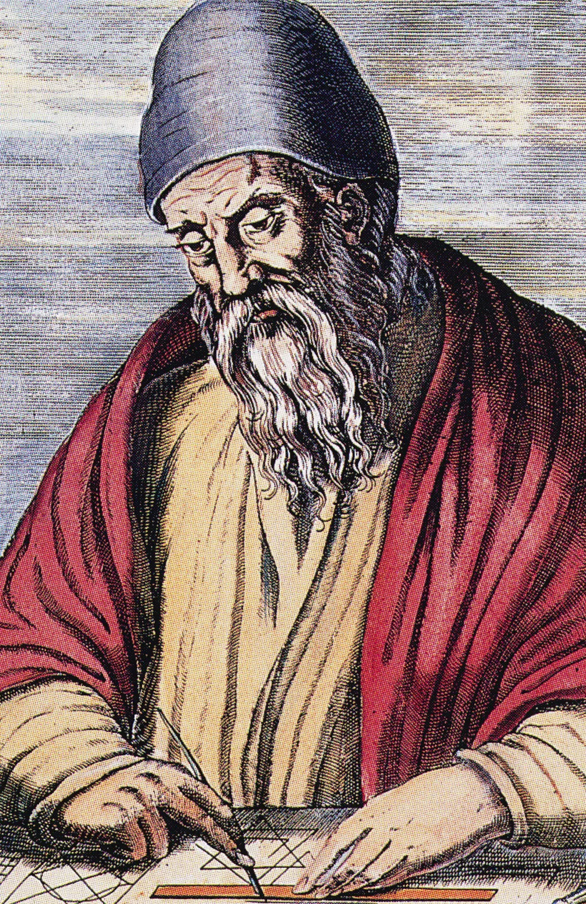

We have used the term 'formal system' very loosely up until now, and while you may have developed an intuitive sense for what it would contain, a more rigorous definition is needed to make sense of the later points in our discussion. The two key components that we need to understand are axioms and typographical rules. Firstly, an axiom is any proposition that you assume to be true within your system. This assumption of truth might seem antithetical to the spirit of a formal system, but for a host of reasons that would take another article to discuss, it isn't logically possible to generate statements that we can say are unequivocally true. It may seem like accepting this fact would kill our hopes of creating a truthful formal system before we're even out of the gate, but looking at what typically passes for axiomatic truth will ease these fears a little. The oldest formal system is Euclid's geometry, of which the five axioms are as follows:

1. Things which are equal to the same thing are also equal to one another.
2. If equals be added to equals, the wholes are equal.
3. If equals be subtracted from equals, the remainders are equal.
4. Things which coincide with one another are equal to one another.
5. The whole is greater than the part.

Each of these is something which we 'feel' is intuitively, almost self-evidently true, but despite this, any attempt to formally prove these assertions will either lead us into an infinite regression or a circular line of reasoning. Unfortunately, some level of dogma has to be accepted to allow us to start doing some real mathematics. A tough pill to swallow but swallow it we must.

The second element of import is the system's typographical rules. These are simply the set of logical operations that you are allowed to perform on the elements of your system. In the case of Euclid's system, this would include something like drawing a line between two points or constructing a circle centred at some point. However, the systems that we will be working with, something which will be explained in more detail shortly, are made up of typographical symbols, as opposed to abstract elements like lines and points. As such, a more representative idea of what our operations will look like are things like the AND/OR/NOT logical operations, addition, subtraction, and a host of what are known as qualifiers.

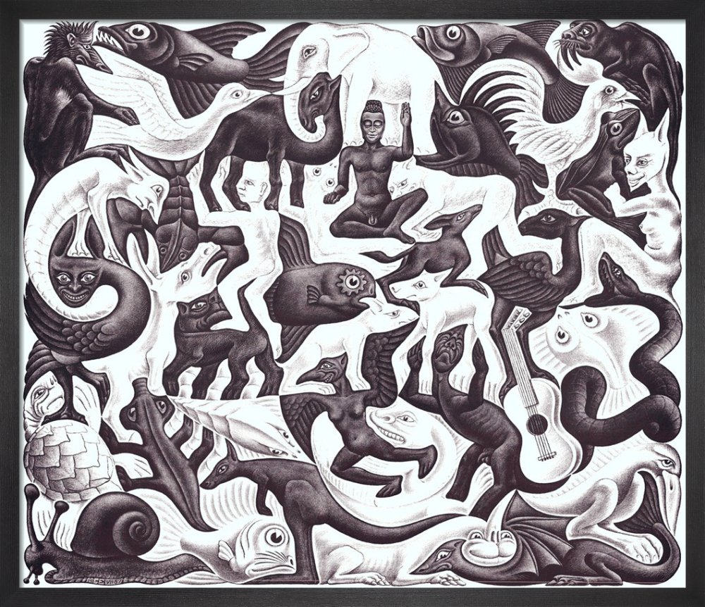

While Gödel used PM as the basis for his original construction, we will be using a much simpler system known as typographical number theory or TNT, developed by Douglas Hofstadter, for ours. TNT contains the minimum amount of expressive power needed to apply Gödel's trick, and as such we can say that the same results can be applied to any system of an equal or greater expressive power, a class to which PM and many others belong. A more detailed explanation of the system can be read <a href="https://cs.lmu.edu/~ray/notes/tnt/">here</a>, but a full understanding isn't necessary to grasp the conclusion. To allow us to get a taste of what actual strings of TNT look like, let's quickly go over two examples.

$$\sim \exists a : Sa = 0$$

This can be interpreted as 'There does not exist a number 'a' such that the successor of 'a' is 0, or in other words, 0 is the first natural number (TNT cannot make statements about negative numbers). To give some more exposition, the '~' can be treated as a negator or simply saying 'not' before some statement. The thing that looks like a backwards E is known as an existence qualifier and can be interpreted as saying 'there exists'. Lastly, it is important to note that the only numeral in TNT is 0, all subsequent numbers are represented by prepending the appropriate number of 'S' symbols known as successors. Here's another statement:

$$\forall a : \exists b : (a+b) = (SSS0 \cdot a)$$

This can be interpreted as 'For all 'a', there exists some 'b' such that 'a' plus 'b' equal 3 times 'a''. The only new symbol here is the upside-down A, referred to as a universal qualifier and is read as 'for all'. To test your understanding, try and translate the following string:

$$\sim \exists a : (a \cdot a) = SSSSS0$$

Now that we've laid the groundwork, let's finally look at what exactly Gödel's construction entails.

## The Gödel string

To prove that TNT is incomplete, all we need to show is that there exists at least one true statement of number theory which is not a theorem of TNT. The term 'theorem' in this context simply means a string that can be derived from our system's axioms by applying valid typographical rules. An example of a non-theorem would be the following string:

$$\sim 0 = 0$$

While this may be a 'grammatically correct' string of TNT, there is no way to start from any of the system's axioms and arrive at this conclusion. However, this is not exactly the string we're after as its interpretation, 'zeros does not equal zero', is false, and as such rightly shouldn't be derivable in our system. The string we are looking for, known as the 'Gödel string' or simply 'G' can be interpreted as follows:

> This string is not a theorem of TNT

How do we know this string is true? Let's first assume that it is false. If this were the case, then in fact G would be a theorem of TNT, thus entailing a contradiction. Since a contradiction cannot logically follow from true propositions, our original assumption, that G is false, must be incorrect. Therefore, G must be true, and thus there exist true statements that are not theorems of TNT, or in other words, TNT is incomplete. It might be reasonable for us to challenge the validity of this proof on two grounds. Firstly, 'If TNT is a system purely designed to talk about numbers, how is it possible that there exists a string of TNT which talks about not numbers, but another string of TNT, itself no less?' and secondly, 'How is this a statement of number theory?'. Assuming that TNT was crafted on the same principles as PM and avoids any opportunity for self-referential statements, how have we created one anyway? The answers to these questions are all rooted in the same idea: Gödel numbering. The working principle behind Gödel numbering, which we will explain in the next section, sounds so trivial that it's hard to believe its destructive power, but upon further reading, I hope that I will communicate why this initial judgement would be misinformed.

## Gödel numbering

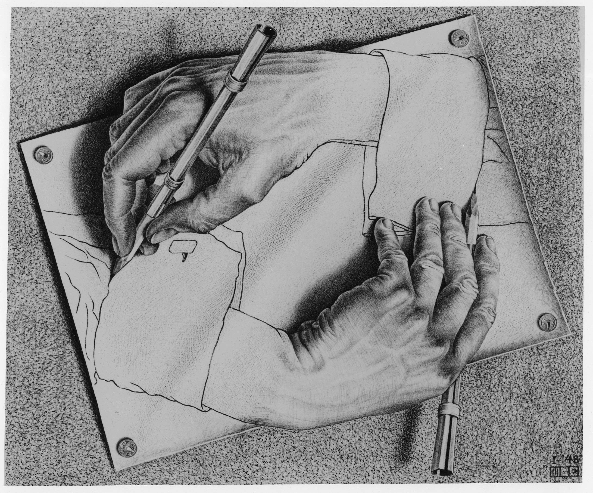

The process of Gödel numbering a formal system can be understood simply as the following:

> Mapping each typographical symbol to a unique number, and thus each typographical operation to a corresponding arithmetical operation.

Just from this definition alone, it is by no means obvious how we arrive at Gödel's string, so to understand this jump there are two other key concepts which we must discuss first: isomorphisms and metalanguages. An isomorphism is a fairly simple but also fairly broad term that can be understood most simply as an information-preserving transformation. This idea of preserving information is the crucial distinction between isomorphisms and other kinds of transformations. We should know if this criterion has been met by the fact that we will be able to translate back and forth between the two 'spaces' of the isomorphism without limit. To introduce this idea, we will start with a simple isomorphism and get progressively more complex.

To begin with, imagine staring into the mirror and noting what the reflection of each object in the room looks like. Apart from things being flipped left to right, they are almost entirely identical. We could say that there exists a rather trivial mapping (we can use this term interchangeably with transformation) between objects in the real world and their image in the mirror world. This mapping constitutes the basis of a simple isomorphism. In this instance we know information is preserved perfectly because, given a full inspection of some object in the mirror world, it would be fairly straightforward to construct its counterpart in the real world and vice versa. A slightly more complex isomorphism, with a much closer resemblance to Gödel numbering, is the mapping discovered by Descartes between lines on a coordinate grid and polynomial equations. This is an idea encountered so frequently during one's secondary maths education that one starts to become blind to its true nature, but it is indeed just another mapping between two spaces. In this case, the information preserving test is the fact that we can find an equation from a line's intersections with the x-axis and equivalently draw a line from the roots of its corresponding polynomial. Now that we've developed our intuition as to what constitutes an isomorphism, it is time we move onto our next key idea, metalanguages.

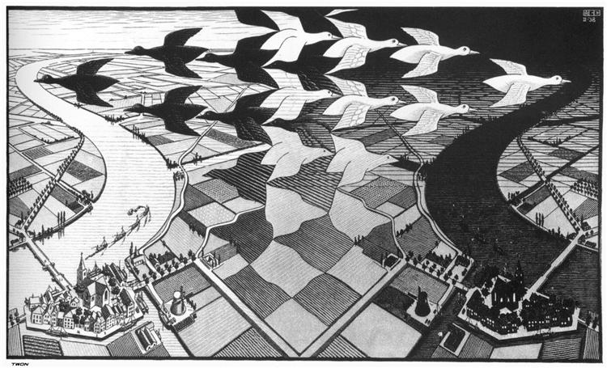

As we discussed earlier, mathematicians are interested in studying the systems used to talk about objects as well as the objects themselves. To talk about objects (numbers), you require a language (TNT), but in order to talk about the system itself, you require what's called a metalanguage. This is a concept that seems very foreign to us at first as natural languages, like English, contain their own metalanguage. That is to say, if I wanted to talk about a word itself as opposed to the object it describes, I don't have to switch to 'meta-English', but I can just simply write something like 'The word “house” has five letters'. Note I am not talking about the properties of houses, but of the word “house” itself. It is a direct result of this fact that natural languages contain their metalanguages that allows inconsistencies like the Epimenides paradox to arise. Conversely, we wouldn't view formal systems as having this property, as if I wanted to discuss the fact that 'String X is not a theorem of TNT', I have to make this proposition in the meta-language, English, as opposed to the language, TNT.

At this point, the implications of Gödel numbering a system should be starting to materialise in your mind. While it isn't self-evident that the complex and varied array of typographical operations we have at our disposal should all be expressible in equivalent arithmetical operations, this is indeed the case. To demonstrate this fact, it would be much clearer to first look at a simpler system that we'll call the 'MIU system'. The MIU system has three symbols, M, I and U, and also one axiom, MI. The typographical rules of the system are as following:

1. If xI is a theorem, so is xIU
2. If Mx is a theorem, so is Mxx
3. In any theorem III can be replaced by U
4. UU can be dropped from any theorem

Here, the symbol 'x' is just a placeholder for any other string, not another symbol. As an interesting exercise, see if you can derive the string MU give the axiom stated above. Given this set of rules, let us attempt to establish a simple Gödel numbering for the system. The symbols are easy to deal with and we can pick the following three numbers arbitrarily:

$$\text{M} \Leftrightarrow 3$$

$$\text{I} \Leftrightarrow 1$$

$$\text{U} \Leftrightarrow 0$$

Under this numbering, we can translate any given string like so:

$$\text{MI} \Leftrightarrow 31$$

$$\text{MIIUI} \Leftrightarrow 31101$$

Now, what would be the arithmetical operation corresponding to our typographical rules? If you feel up to the task pause for a second here and try to work it out yourself. The answers for the first two are given below.

> If we have 10m + 1, then we can make 10 x (10m + 1)

> If we have 3 x 10m + n, then we can make 10m x (3 x 10m + n) + n

Here m and n just represent any natural number. From these examples, it might be a bit easier to see how we can extrapolate this idea out and using a combination of multiplication, addition, subtraction, and division, express any typographical rule as an associated arithmetical one operating on those symbols' Gödel numbers.

The crucial insight from this discussion is as follows. Given a sufficient amount of expressive power, it is always possible to Gödel number a system, creating a mapping between the operations in that system to a set of corresponding arithmetical operations. As a result, any meta-statement that we wish to make about our system's properties, which is equivalent to making a statement about some sequence of its operations, can be mapped into some equivalent statement about some rather lengthy and contrived arithmetical process. The latter is the exact kind of thing that TNT is purpose-built to discuss, and so, by expressing certain statements about arithmetical operations in TNT, we are also inadvertently expressing isomorphic statements of Meta-TNT. In short, it is because we can always construct this mapping that TNT implicitly contains its metalanguage and is thus capable of self-reference. To sum, the isomorphism produced by Gödel numbering a system is outlined below.

> Typographical symbols ⇔ Numbers

> Typographical operations ⇔ Arithmetical operations

> Strings of TNT ⇔ An equivalent Gödel number

> Statements about certain numbers ⇔ Statements about TNT

Now that we know we can create strings of TNT capable of talking about other strings of TNT, we know self-reference is possible, and thus the only thing left to wrap up is an explanation of the specific way in which we construct Gödel's string. The details of this however are much too complex for me to be able to explain succinctly and are also largely superfluous to our overarching point, but on an extremely high level, the process involves a combination of the following two ideas:

> Creating a string that states whether some other string is a correct derivation of some given proposition.

> Creating the string generated from substituting the Gödel number of some other string in place of that same string's own free variables.

These two ideas combined with a few qualifiers form the pieces from which Gödel's string is constructed. If you're interested in a more in-depth explanation of how this feat this achieved, I would highly recommend picking up a copy of Hofstadter's Gödel, Escher, Bach yourself. All in all, we can now say that we have proved or at least outlined how to prove the fact that TNT is incomplete, and since this result applies to any system which expands on TNT, by extension we can say that it is impossible to create any complete formal system of number theory. In effect, this result is equivalent to stating the fact that there exists no 'mechanical' decision procedure for number-theoretical truth &#8212; an intelligent agent is needed to make mathematical progress. There are just two more discussion points I want to mention before closing off Part I. Firstly, we've used this process to prove incompleteness, but what is the effect this had on consistency? Secondly, now that we know the secret of Gödel's trick, can't we find a way to circumvent it? Both of these points will be expanded on below.

## How does this hurt consistency?

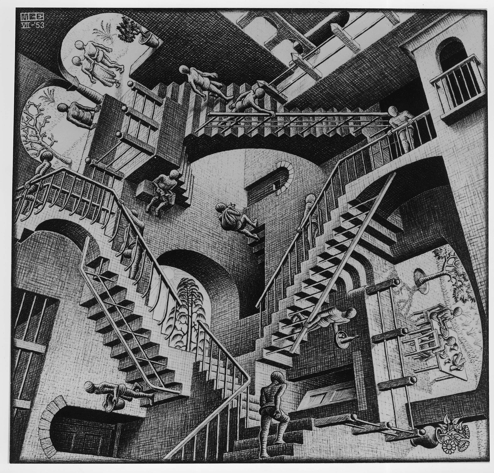

A similar argument to the one used above can also be applied to show that it is impossible to prove a system's consistency from within the system, that is, to be sure that it can't produce two contradictory statements, x and ~x. What Gödel shows is that this claim is equivalent to stating that a single sentence of TNT (for example ~0 = 0) is a non-theorem. By another lengthy construction we can show that as long as TNT is consistent, it cannot express this 'oath of consistency', and worse still, this is only possible if TNT is in fact inconsistent! Proving a system's consistency from outside the system doesn't improve this problem either, as this proof must be constructed inside of yet another whose consistency is just as unprovable from within itself. This process can be continued ad infinitum and get no closer to absolute truth. To sum, Gödel's method of proof has allowed us to demonstrate two facts:

1. No system of number theory can ever contain all true statements of number theory. This is a result that can be applied to any larger system of mathematics that possesses the sufficient number-theoretical 'tools' at its core.
2. No equivalent system can be used to prove its own consistency; the guarantee that it will never produce two contradictory statements.

Now I can imagine at this point I suspect you may doubt the finality with which I have stated these results, but I assure you this has been a result that many minds greater than you and I have tried desperately, and ultimately in vain, to undermine. While I can't anticipate all of your concerns, I think it is worth going over the few that swirled around my head during my first reading and attempt to convince you that incompleteness is not just a property of the particular formal system we've contrived in this essay, but an essential quality of all formal systems of number theory.

## Is TNT essentially incomplete?

There are three criticisms I'm going to attempt to refute in this last section, the first concerns the term 'expressive power', the second the idea of simply adding more axioms, and the third and most abstract relates to the notion of meaning.

Let's begin digging deeper into a phrase we've used fairly liberally up to this point: 'sufficient expressive power'. This is a notion discussed at length in the works of people like Alonzo Church and Alan Turing and lies at the heart of what is known as 'computability theory' which is essentially the study of which functions are and aren't computable. Analogously, one can say that the 'expressivity' of a language is a measure of which properties it can and can't make statements about. From this definition it is clear to see that not all languages are equally expressive, for example, a version of English that only includes words beginning with “W” would have far less expressive power than the full, unrestricted version. A similar comparison can be made between computer languages, or in our case, formal systems. Since the construction of Gödel's string requires us to make several statements about numbers and arithmetical operations, there is a minimum set of 'vocabulary' that a system must possess to be able to express these statements and thus allow us to apply Gödel's trick. The threshold for this ability can be found from a careful analysis of the details of the construction and is technically defined as the ability to expressive all 'general recursive properties'. But what does this mean? The most succinct analogy can be better appreciated if one has a small bit of programming experience but can still be mostly grasped without it. The analogy is as follows: if there exists a program to compute whether a number possesses some property, and any loops in that program are terminating for all inputs, then we can say that property is 'general recursive'. Here the word terminating simply means that some loop doesn't have the possibility of going on forever. Interestingly, this constraint on 'free loops' makes this a slightly more restrictive qualification than Turing completeness for anyone familiar with that idea also. Naturally, we can ask the following: 'If our system needs to be able to express all general recursive properties to be 'Gödelized', why don't we simply make one that falls below this qualification?'. This is a valid suggestion, and we have already encountered a system that falls into this category: the MIU system. While it is a fairly involved process to show formally, we can already see intuitively that given the fairly limited set of typographical rules, there aren't many mathematical truths that we could express using the MIU system. It is important to note that what we mean here by 'expressing' a truth is simply that it can be mapped isomorphically to a string in that system. This same line of argument can be applied to any other systems that fall below the marker of general recursive. Due to their expressive insufficiencies, these systems are even more incomplete than ones like TNT, but just in a less interesting way.

Our second criticism might have seemed obvious to anyone comfortable with the idea of axioms and can be summed up as 'Why don't we just add G as another axiom in our systems?'. Again, this may seem like a silver bullet to our claims of incompleteness, but all this does is simply kick the can down the road. Once we are familiar with the original procedure, it's fairly trivial to express 'This string is not a theorem of X', where instead of 'X' being 'TNT' it's now 'TNT+G'. The key to this is changing the section of Gödel's string concerned with stating whether some string is a valid derivation of another. This same process can be repeated ad infinitum, constantly allowing us to poke new holes in our system right after patching up previous ones. Because of this, we can say that formal systems of number theory are not just incomplete, but essentially incomplete, that is no alteration to their structure (that doesn't diminish expressive power) can ever make them immune to 'Gödelization'.

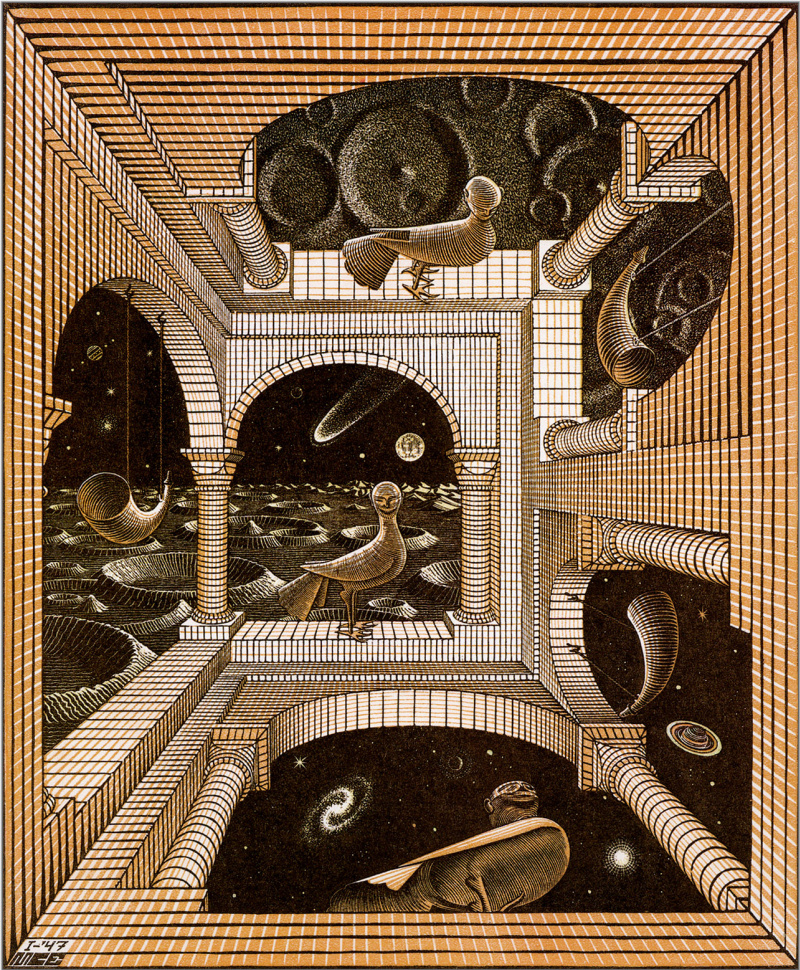

The last criticism is hard to put into words but follows along the lines of 'Just because we've used Gödel numbering and created this mapping, why does this necessarily imply any notion of 'meaning' should be translated along with it?'. Another way we might look at this is by asking 'Was TNT incomplete before we discovered its Gödel numbering or are we simply unearthing an intrinsic 'fact' about the system that would have existed with or without us?'. This is the mathematical equivalent of the old question about the tree falling in the woods. I think all concerns of this variety can be broadly summarised by the question 'Are abstractions real?'. This is more a question of the philosophy of mathematics than anything particularly novel that Gödel has done and is ultimately rooted in our acceptance of what is connoted by an isomorphism. While this assumption may seem dubious here, the idea of 'translating meaning between spaces' is something that doesn't seem so unacceptable in the previously mentioned example of the cartesian isomorphism between lines and equations. Most of us probably never sought to question the deeper 'why' that allows us to know the properties of an unseen line from facts about a seemingly unrelated string of symbols. The correspondence was presented to us in a tone of such self-evidence, and equally comprehended as such, that it was a question that seemed too trivial to be worth asking. This kind of uncomfortable feeling about the deeper 'trustworthiness' of mathematics has a similar tone to that of axiomatic truth &#8212; deep down we feel it to be true, but we can't express why. I think the only resolution that we can find here lies in a reinterpretation of what we're implying when we say one statement is meaningful and another is meaningless. I propose the following definition provided by Douglas Hofstadter:

> Something is meaningful if it maps isomorphically to reality.

Accepting this proposition comes along with a much broader acceptance of two other things. Firstly, that the same object can have multiple, equally valid meanings that arise from the fact that it can be interpreted on different levels simultaneously. In this case, the particular number-theoretical statements that our system is talking about are both simply facts of arithmetic and facts about TNT. Accepting both of these interpretations is not a contradiction. A similar idea can be seen in the way that we recognise other people as both a collection of cells following a strict set of rules and a conscious being that is capable of error and originality. The relevance of either point of view depends on the context in which we are viewing someone, be it a medical examination or a chat over coffee, but a belief in the validity of one by no means discounts the validity of the other. Secondly, that an object's 'meaning' is not something ethereal and indefinable, but simply an informational property, in particular the information that encodes how it relates to itself and its environment. If some mapping preserves information perfectly then as a consequence of this we must accept that meaning must be preserved too, that is unless we feel like dabbling in metaphysics. Just like how the meaning of an instruction (for instance 'pick up that box') can be translated from English to French, or the meaning of a number from decimal to binary, we must become comfortable applying the same reasoning here as well as the logical consequences that follow. If our model of reality seems to differ from reality itself, we should seek fault in the former, not the latter.

This concludes Part I, along with the majority of the mathematically dense ideas in this essay. In Part II we're going to explore the implications of these results on the philosophy of mind, the nature of creativity, and the limits of consciousness. Part II will contain many more questions than answers but, in some respects, this tends to be the more interesting half of the equation. So, with no further ado, let us proceed.

# Part II

---

## We are self-referencing systems

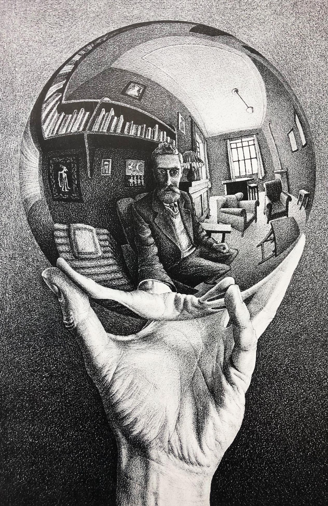

Consciousness is a fairly ill-defined property. While we believe animals are the only configurations of matter that exhibit it, we are none the wiser as to what point on the phylogenetic tree we can say things begin to be conscious. However, I know of no apparent reason why the transition to consciousness ought to be a continuous one. Perhaps once some condition analogous to 'general recursive' is met within any information processing system, it experiences a discrete jump to the particular variety of consciousness we're familiar with. There may even exist more, infinitely more complex conditions that if obtained push a system up to the 'next level' of conscious experience &#8212; I see no reason for the process to have some predetermine ceiling. In contrast to this view, there is a school of thought known as panpsychism whose proponents believe consciousness to be a pervasive property of all matter, just in varying degrees. While this is an interesting idea it is largely unfalsifiable and as such is not the most fruitful subject of discussion. While consciousness is a phenomenon that we are all intimately acquainted with, in fact by definition conscious experience is the only thing we can 'be aware of' so to say, we scarcely understand it. Most of the challenges with understanding it can be tied to the fact that uniquely, among all fields of study, we are both subject and object. In other words, the study of consciousness is equivalent to a system attempting to make self-referential statements. Perhaps this link might be a clue to at least part of the puzzle. What to us feels like consciousness, might be, like incompleteness, an emergent consequence of a systems self-referential nature. However, despite all this, the one, or possibly even (in faith with the Cartesian tradition) the only thing we can be sure of is that we are conscious. Cogito ergo sum, and thus if we have any pride in our claims to be scientists, philosophers, and even human beings, consciousness perhaps more than anything, ought to be something we are striving to understand.

## Consciousness and Isomorphisms

At the heart of understanding TNT's self-referential nature, and thus the construction of Gödel's string was the isomorphism we identified between typographical symbols and numbers. It is important to understand that it is not all isomorphisms that would've brought about this property but only the particular class that we employed here, that being a mapping between a system's language and its subject matter. Say if we had instead mapped typographical symbols to different types of pasta our dreams of completeness would still yet be alive. It is only because Gödel numbering is an example of a 'language-subject' mapping that our system looped back around on itself like the Ouroboros. This insight naturally leads us to ask, that if this is this is the mapping that allows a system to become self-referential, what is the analogous isomorphism that allows us to self-reference. In other words, what is the equivalent 'Gödel numbering' of consciousness? It is difficult to say whether the primary subject matter of consciousness is reality or the abstractions that we use to describe it or even whether the notion of a 'primary subject matter' is a meaningful statement to make. As for the typographical language in which consciousness is expressed, the jury is also out. There is ample evidence for certain regions of the brain being responsible for different tasks, but on a neuron level, we are none the wiser as to where individual 'symbols' seem to be stored, if anywhere at all. By all accounts, the notion of symbols and ideas appear to be an emergent property of the lower-level behaviour of our brains that we haven't quite pinned down. While there are still many questions for us left to answer, it is not unimaginable that discovering the ideas behind this isomorphism will be one of the keys to developing a more complete theory of consciousness. Whether we will embrace this newfound knowledge with wisdom and maturity, or simply retreat into superstition and ignorance is another matter, but I am optimistic about the better angels of our nature.

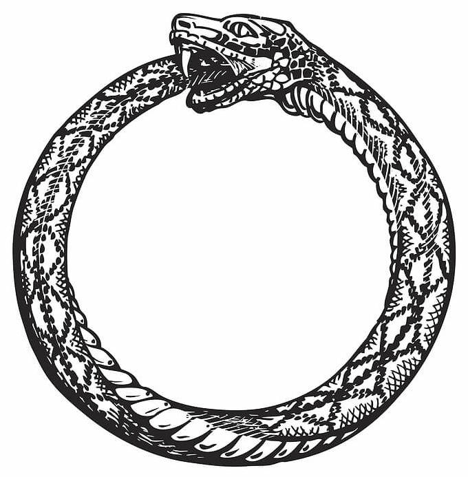

Another interesting extension of this Gödelian analogy is (assuming our minds obey the same underlying principles as any other formal system, a big if that we'll discuss shortly) the question of what it means for our mind to be 'incomplete'. If we consider the closest analogy, perhaps there are truths that we are fundamentally incapable of grasping, not out of dogmatic denial, but simply fundamental 'blind spots' in our cognition. Another interesting but much more speculative idea is the possibility of states of consciousness that can be understood in theory, but not physically rendered in our minds, like four-dimensional space. While cybernetic enhancement may expand these capabilities, the equivalent 'TNT+G' of consciousness would fall victim to the same infinite regression we demonstrated earlier, always leaving a 'complete' consciousness experience beyond our reach. Perhaps this 'complete consciousness' is what is alluded to in the teachings of mystic religions like Buddhism, but if this is an unreachable goal what does that mean for us? Taking these ideas even further, what is the equivalent 'Gödel's string' of consciousness? Hofstadter plays with this idea in another one of his books titled 'I am a strange loop' in which a group of researchers discover a sentence that instantly puts anyone who reads it into a coma and subsequently run into a fair bit of trouble trying to contain it.

If our minds do operate on the same underlying principles as any other formal system, perhaps this is an explanation for why our abilities to introspect are so poor. In the same way that TNT cannot demonstrate its own completeness or consistency from inside the system, perhaps we are fundamentally limited in our capacity to understand our own motivations and desires. Without being able to somehow 'jump out of the system', Socrates' advice to 'know thyself' could be chimeric. However, this pessimistic reality hinges on our assumption that consciousness is computation or at least computation as described by our present understanding. This is the essential idea behind something called the Church-Turing thesis and is still a hotly debated matter. To me neither, side is obviously true, but even if conscious experience can be faithfully rendered with computers, on the way to achieving this we may discover that our current theory of computation is not wholly incorrect, but perhaps merely subsumed under a larger theory with much greater explanatory power (much like the fate of Newtonian mechanics) and not subject to these apparent epistemological limitations. One piece of evidence that might point in this direction is the phenomenon of creativity.

## Is creativity computation

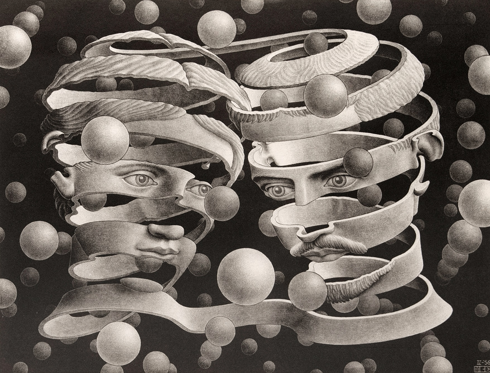

To say that we are at the 'authors' of the ideas that come to us in flashes of creative insight almost doesn't feel right. With no extra amount of, at least conscious, effort dedicated towards a problem, a solution often presents itself to us 'out of the blue'. While this isn't an explicit indication of any extra-computational processes occurring in our minds, it is at least obvious that simply simulating what we know is going on won't be enough to capture the full richness of our minds. The general principle that all modern machine learning algorithms follow is essential to train a large inductive reasoning system that, given enough prior examples, can isolate and interpolate between relevant features and apply this knowledge to future examples. However, because of the work of philosophers like Hume and Popper, we know that the assumption that new human knowledge is reasoned inductively from prior experience is not a logically consistent theory. This fact seems to be most clearly highlighted to us in the explanatory power of new scientific theories: the precision to which Newton's laws allowed us to predict the orbits of the planets was orders of magnitude greater than the resolution of the data which he had at his disposal to devise them. But where did this extra information come from? At present, something akin to creatio ex nihilo seems to be our best explanation. Maybe we may be able to model this process computationally, but a simple extrapolation of our current approaches will likely never gain this 'creative spark'. We require something entirely new to reach beyond inductive reasoning. However all this being said, the problem of consciousness by no means strikes me as insoluble, and I feel quite confident that one day we will have a working theory of consciousness that doesn't just expand our insight into our minds but also a greater understanding of the nature of information and grander part it plays in the cosmic dance.

## Conclusion

The ideas discovered by Kurt Gödel and others that are expounded upon in Hofstadter's seminal work are so intimately woven into the fabric of reality that it has not been impossible for me to fully digest them without completely upending every corner of my worldview. While I had many interesting takeaways from this book the one that stood out to me the most was this: the progress of knowledge cannot be mechanised. While 'thoughtless' mechanical tools can be of much use in mathematics, logic, science, and even philosophy, intelligence, not necessarily human but intelligence nonetheless is required if we want to illuminate the darkness and push the boundaries of knowledge. I do not doubt that moving into the future, an ever-greater proportion of this intelligence will inhabit a different form than the sole kind we recognise today, but I also believe that in many more ways, we will have a surprising amount in common. Gödel's incomplete theorem is, in my opinion, one of, if not the most profound result ever produced by the field of mathematics and more than any other, has given us a unique insight into the very heart of the universe.
