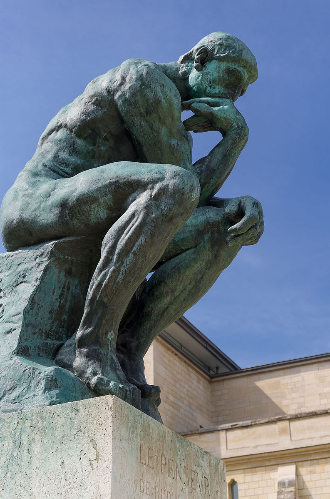
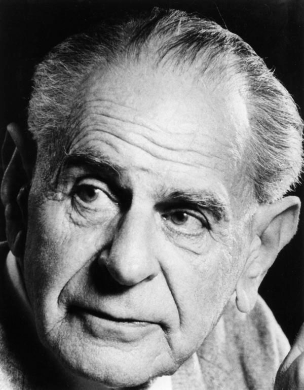
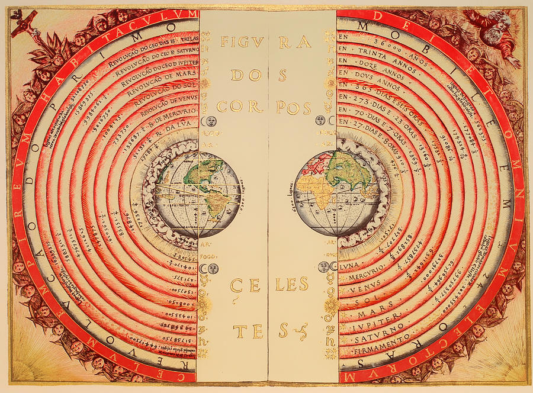

_'Le Penseur' in the Musée Rodin in Paris_

In a world before the scientific revolution, it was not uncommon for a learned person to have earned the title of a polymath, meaning they had a high level of knowledge in many different fields. In ancient times, it was not inconceivable for a single expert in some field to possess the entirety of that field's knowledge. Given the exponential rate at which knowledge is growing today, it would be reasonable to assume that achieving this level of erudition is not possible anymore, but in his 1997 book 'The fabric of reality' David Deutsch argues the exact opposite: that it is more possible than ever. In this essay I am going to give a brief overview of Deutsch's worldview, the role that explanations play in it and the implications this has for an individual wishing to understand the world.

To begin, our priority should be a clarification about how exactly knowledge advances. At first, it may make sense to measure the extent of our knowledge by the predictive power it gives us, that is how well do my predictions line up with reality? However, this definition would be a logical error, an error that has troubled philosophers and scientists for centuries, more formally known as the problem of induction. The problem of induction essentially asks the question 'how can past observations ever justify future predictions?'' The short answer is they cannot, but there is a solution invented by Karl Popper, the 20th-century philosopher of science, that still allows us to develop scientific theories without the same shaky logical foundations. Firstly, to illustrate this problem more clearly, we can look at an example posed by another 20th-century philosopher Bertrand Russel. A chicken being fed by a farmer might make the seemingly reasonable assumption that given the farmer has fed him 50 days in a row, he is likely to be fed for another. The prediction here would in fact be correct. With each correct conclusion, the chicken's surety of his predictive powers would only become increasingly certain. After 1000 days of being fed it would seem almost a given that the farmer would feed him on day 1001, that is until the farmer wrings his neck. Our poultry friend made the same mistake that scientist had been making for thousands of years, using past observation to justify predictions about the future. Karl Popper not only showed that this approach cannot be logically justified, but also suggested an alternative approach to the creation of knowledge.

_Karl Popper_

Rather than the creation of knowledge being a series of observations leading to a generalised theory, we should treat scientific discoveries as a series of problems with conjectured solutions. While the difference may seem subtle on the surface the implications of this shift were monumental for the scientific community, finally allowing a solid bedrock for their enterprise. Popper posed that once we have identified a problem with our pre-existing explanation of the world, we conjecture a bold, unjustified solution to it through some new explanation. We then attempt to disprove this explanation and also any other competing ones through experimentation. If we cannot disprove it, then its use becomes tentatively justified, but always subject to abandonment if a better explanation is proposed. There are finer philosophical constraints as to what the contents of this explanation can be, but the key points are these. It is logically justifiable to use reason to create theories that allow us to understand the world. However, these theories are not justified on the basis of their predictive power, but by their ability to solve the problems that they were proposed in response to. We can therefore say this: that the source of explanation is not reality, but the human mind. A 'deeper' explanation is one that is more general, incorporating more connections to a broader range of ideas, and explaining more with fewer assumptions. Therefore, our goal is not amassing volumes of trivia, but to use our minds to invent the right concepts, explanations and theories that allow us to understand reality. Observation is a necessary but not sufficient condition to our end goal.

Now that our venture is logically justified, we can begin to reduce the task at hand. One key observation Deutsch makes is that new knowledge does not necessarily entail new understanding. For example, an astronomer who understands the working principles behind the motion of the planets through Einstein's theory of general relativity may gain new knowledge by observing the transit of Jupiter across the night sky — learning its particular location at particular times — but no new understanding is gained from this, only new facts. What this realisation allows us to infer is that we do not need to observe everything to understand everything. We can in theory derive a complete understanding of reality from only a subset of its phenomena. In fact, we can take this a step further. It has typically not been a broader basis of observations that lead us to find errors in our current explanations of the world, but more minute ones. For example, Galileo's observation that Venus went through all phases, not just crescent and new ones as predicted by the geocentric model, gave credence to Copernicus's heliocentric theory of the solar system. It is not necessarily the case that we need to see reality in more breadth to gain a more complete understanding, but perhaps only in finer detail.

_The Ptolemaic geocentric model of the universe (1568)_

But does this fact really help us? The necessary subset and resolution of phenomena may not be all of reality, but it could still be impractically large and unfeasibly detailed. Even still, we are continuously producing new theories about the intricate workings of ever smaller corners of our world. As a result, new fields and sub-fields are constantly popping up concerning ever more esoteric domains of knowledge. However, it is important to note that as new, better explanations are invented, the old ones are often 'demoted' and no longer constitute a place in our world view. Hence, one does not need knowledge of all the theories that ever were to gain a complete understanding of reality, just the minimum number of sufficiently deep ones. To illustrate this, we can think of a modern mathematician who, somehow, has never encountered roman numerals before. By learning about them and their associated processes for adding, multiplying, and so forth, this mathematician does not gain any new understanding about the underlying mathematics they represent, merely the properties of arbitrary symbols. This process of demoting once again allows us to drastically reduce the scope of our task.

One last thing we need to accept is that, while it may appear that our explanations are becoming more convoluted and difficult to understand as a function of their explanatory power, the opposite phenomenon seems to be the case. If a medieval society wished to construct a large bridge or cathedral, they would have had to enlist the known-how of a master builder. This master builder would not be able to express their knowledge in terms of mathematics or physics, but rather, it would largely consist of a set of guidelines and rules of thumbs for different specific scenarios that they had learned during their apprenticeship and experience. While this may have been sufficient for the replication of tried and tested structures, when applied to new, novel designs they would not be of much use. In contrast, a modern architect or civil engineer is capable of designing larger, more complex, and safer structures in both familiar and novel contexts. Yet despite this, their training only takes a fraction of the time, how is this possible? This can be singularly attributed to the merit of the explanations that they leverage. While each of the individual theories involving ideas of force and material properties may be harder to understand than any of the master builder's rules of thumb, they are far fewer in number and allow for far broader application. Additionally, their explanatory power gives them other properties such as beauty, inner logic, and a connection to other ideas, which makes them easier to learn.

_Milan Cathedral_

What these examples demonstrate is that two competing forces are governing the growth of knowledge: breadth and depth. Breadth has the property of dividing and complicating whereas depth unifies and simplifies. The questions as to whether we can understand everything that is understood depends on the balance between these two effects. Deutsch believes that, slowly but surely, depth is winning, and I would say the more of his work I read, the harder it becomes to disagree with this thesis.

For me, Deutsch's world view is hugely optimistic. To him, truth is not some scarce resource that can only be accessed by the intellectual high priests and academics of society. We do not need to own mountains of cash, complex machinery, or secret tomes to be able to learn things that are deeply, profoundly true. In fact, the more fundamental a truth is, the more far-reaching its observable effects will be and thus the more readily available it is to being discovered. In the age of the internet, this is especially true. Reality, in all its complexity and beauty, can be understood by any one of us, all that is need is our mind and the desire to learn.

The obvious next question from this is 'what are the minimum number of sufficiently deep theories?'' For the rest of his book, Deutsch argues that reality can be explained by a set of theories he calls 'the four strands' which consist of the following:

1. Hugh Everett's many-worlds interpretation of quantum physics
2. Karl Popper's epistemology
3. Alan Turing's theory of computation
4. Richard Dawkins's refinement of Darwinian evolutionary theory

I may write a longer essay fully explaining these ideas at a later date.
