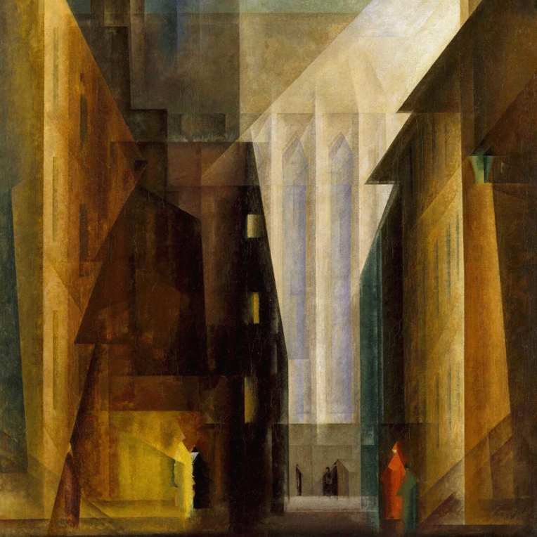
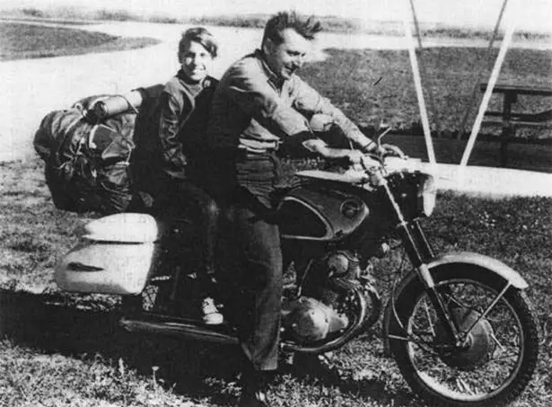

_Chuch of the Minorities II (1926) - Lyonel Feininger_

# Introduction

The principal issues that this essay will address are twofold, but ultimately, heads of the same beast; the unsatisfactory nature of work, and the encroaching influence of technology.

The first may be observed in popular phrases among graduates such as 'selling your soul' or 'the golden handcuffs'. The implication being that this is the price one must pay for any work that is socially respectable or economically attractive. While this is almost ubiquitously seen as negative, the tone with which these sentiments are expressed is often quite nonchalant. As if a different state of affairs would be to both have your cake and eat it, and thus is accepted as a necessary trade-off.

The second is something I myself feel quite strongly, and its presence can be felt in the whispers of the cultural zeitgeist. We have collectively developed a yearning for a return to nature, a time prior to technology and large-scale societies when life was meaningful and people were good. There's a game me and my girlfriend play on holiday: we're banned from using our phones to get back to our hotel from wherever we happen to be. It is often much slower, but when you have to pay attention to your surroundings they become enormously more captivating. You don't just feel like a passive observer, <i>you're in the scene</i>. In no world would I class myself as a luddite, but I feel acutely aware of the aesthetic charm of operating in the world that has been robbed from us by accepting the Faustian bargain that technology presents. While we certainly have the option to communicate in handwritten letters and walk for days between cities, when robbed of the command of necessity these activities lose much of their tranquillity. Deep down you know you are still attached to the umbilical cord of society and there's nowhere so far that it doesn't reach.

The thesis of this article is that the root of both of these issues can be traced to a common cause, something I've called the <b>ontological-praxeological split</b> (OPS), or more simply, a separation between <b>who we are and what we do</b>. The unflinching acceptance of the premise of the phrase 'work-life balance' is evidence to how deeply rooted this schism lies. In a very real sense all you are is what you do, especially what you do every day. Given that this is the cause, how then do our two problems logically follow, and even more importantly, what should we do about this? To understand and remedy this split we're going to begin by looking into the ideas of Robert Pirsig and his 'metaphysics of Quality'.

# Classical and romantic reality

_Robert Pirsig and his son Chris_

Zen and the art of motorcycle maintenance (1974) is a work of literary philosophy by the writer Robert M. Pirsig. It follows the story of the Narrator, his son Chris, and his friends John and Sylvia Sutherland on a motorcycle trip across the American west. The story is punctuated with a series of philosophical 'chautauquas' from the narrator whilst interspersed with the tale of his former self — someone he refers to as phaedrus — his decline into insanity and subsequent change of personality brought about by electric shock therapy. The central idea of the narrator's worldview is called 'Quality', but to better understand this idea and its applicability to the OPS, we need first to explain some of the other key ideas presented throughout the course of Pirsig's chautauquas.

What starts our journey is a pattern of behaviour our narrator notices regarding his friends' attitudes towards motorcycle maintenance. He has a technical background, and as such, a proclivity for the autodidactic and methodical nature of motorcycle maintenance. The Sutherlands are the complete opposite. They are both well-read people — albeit not when it comes to motorcycles — but he slowly begins to realise that the root of their ignorance is deeper than a simple apathy for the subject; consciously or otherwise they refuse to learn about technology. On multiple occasions they come to him with problems and he suggests simple and quite resourceful fixes. Yet if these ever involve violating the sanctity of their expensive motorcycles by improvising a tool or doing things counter to the manufacturers intent, they shut off and just accept whatever problem they've discovered. Over the course of a few more conversations the narrator realises the cause of this seemingly irrational behaviour. The Sutherlands are resentful about the encroaching influence of technology and 'the system' on their lives; how its inexorable march is robbing everything they love of its beauty and leaving behind soulless replicas in its wake. He begins to realise further that the reason they are even on this trip with him in the first place is to escape this technological spectre. Having to acknowledge their bikes as just another one of the system's machines drags them back down to reality, reminding them once more of the futility of their flight. By refusing to learn the language of the system — gears, belts, pistons, and oil — they can still retain the romanticism that comes from only knowing the surface reality of something and cling on to their fading world for just a little longer.

What then are the insights that we can gain from this story? Pirsig splits human thought into what he calls two 'modes': the classical and the romantic. The intellectual history of the classical mode is rooted in ancient greece. It deals with logic and rationality, but most importantly, views the world through <i>underlying forms</i>. The romantic mode is rooted in the philosophical and artistic tradition of the same name that began in late 18th century europe. By contrast, it is concerned with aesthetics and intuition, instead viewing the world through <i>immediate appearances</i>. Both represent an incomplete picture of reality and reveal truths hidden from the other. Having an entirely classical view of the world gives an ugly and sterile perspective, missing the beauty of immediate appearances. On the other hand, an entirely romantic view is impractical as some understanding of underlying forms is required to solve life's problems. This classification provides the starting point for our analysis, and puts us into a position to ask some important questions. What is the demarcation between the classical and romantic modes, and how can we devise a system of thought that unifies the two? The suggested solution to both of these questions is to be found in what Phaedrus called Quality.

# Quality

The narrator's former job was a professor of English literature, and as such he spent a great deal of his time thinking about what made a good essay and what made a bad one. He felt a common incongruity: that while we expect students to produce great writing by understanding underlying forms like precision, depth, and clarity, actual great writers didn't use checklists or frameworks to make their work compelling, they just wrote, only paying attention to immediate appearances. He conducted an experiment with his students, showing them several pieces of work and asking them to rank these best to worst. Both the 'good' students, those who knew the 'underlying forms' of good writing, and the 'bad' ones, those who didn't, would reliably agree on the quality of the different pieces. Why was he teaching his students something they already knew? And if they already knew what quality looked like, why couldn't they produce it? This was his initial line of questioning, but it led him down a second one that proved to be unexpectedly richer: what is “Quality”? Everyone recognises quality, but when you try and define it falls through your fingers like sand. Some things are clearly better than others, but when you ignore the specifics and try to get at the notion of 'better-ness' itself you draw a blank. Quality's resistance to being pinned down by reason put the following idea at the centre of his mind: that there are some realities beyond the reach of rationality.

The first of our problems is practically solved for free by allowing Quality into our worldview: that which has Quality falls into the romantic mode, that without it, the classical. A neat division that Phaedrus found himself quite proud of. Art, music, baseball, and fine dining. All these contain notions of better and worse, the worth of an item, a player or a restaurant. They're all romantic reality. Philosophy, logic, mathematics. A theorem cannot be better or worse than another. It's true or it isn't. These all constitute classical reality. He seemed to have accidently divided the world in two: Quality and Reason. You can decide which music to listen to based on Quality and it resists rational analysis. You can favour one system of mathematics over another because of reason and it resists qualitative analysis. While this is all theoretically interesting it isn't groundbreaking. To find how why we should care about Quality we must continue with the rest of phaedrus's story.

# Mind and matter

Does Quality exist in the subject or object? This is the question that gave rise to the second phase of Phaedrus's journey. If Quality is subjective then its simply the arbitrary whims of the observer and he hasn't really discovered anything interesting. If it's objective, then why is no instrument able to detect it? Both horns of dilemma seem like a bad result. In an attempt to answer this, he gradually realises that neither of these classifications make sense. Either we're left with a set of propositions with logically unsound repercussions, like the unreality of numbers and scientific laws, or are force to accept casuistic refutations like “Quality is just what you like” — without “just” this sentence is logically unchanged and is a simple truism. Intellectually, we are left in a tricky position. Quality must exist, as a world without it would be perceivably different. But to reject both mind and matter forces us to create a new category of reality and we arrive at Phaedrus's metaphysical trinity: Subject, Object, and Quality.

How are these three elements related? Again any independent relation between Quality and either subject or object is fruitless. Why? <i>Because Quality is only found in the relationship of the two with each other</i>. It is not a thing, it is the event at which the subject becomes aware of the object. Not only this, but by trying to fit Quality into the Procrustean bed of the western canon we've been putting the causal arrow the wrong way round. The very notion of an object implies the awareness of a subject, but Phaedrus was focused on the split second between seeing something and becoming aware of it. He proposed that in this pre-intellectual reality, prior to both subject and object, there is only Quality and therefore it must follow that Quality is not only distinct from both subject and object, but is in fact the ground from which they both spring. What we're left with isn't a trinity but a monism — there is Quality and only Quality.

With this change in perspective, our initial division of Quality and reason was a red herring. If all we have is Quality, the classical and romantic modes are simply different aspects of it. How then does this superficial demarcation arise? Simple: classic and romantic reality (Quality) are simply two different time aspects of the same event. If one considers the past and future to both be contained in the present, you only pay attention to the immediate appearance, and hence we have romantic Quality. Conversely, if you take the present to just be a slice between past and future, you pay attention to the interactions between a series of ideas and hence get classical Quality. If your motorcycle is working right now, preoccupation with things like oil levels and tire pressure seem superfluous to the romantic, but good Quality to the classical.

So what have we really learnt from our metaphysical soirée? The true cause of the strife between classic and romantic types isn't an incompatible set of values, but a diverging time horizon. This then begs the question of the 'right' perspective. Too long and you 'miss the forest for the trees', but too short and don't have the tools to solve your own problems. We'll be able to sneak up to this question in the next section as well as addressing our initial questions: why is so much of modern work unsatisfactory and why are the advancements of technology only making us feel more isolated?

# Work and technology

The Sutherlands' worldview is a commonplace sentiment of modernity. That a person is mostly good. That the dynamics of small scale communities are usually amicable and conflicts can be solved peacefully, or at least tolerated quietly. It is not people, but rather the scale and speed of the social dynamics technology allows that brings out the worst in us. That no one person at Facebook wants to rob us of our autonomy, nor is any one employee at BP in favour of environmental destruction, instead technology is a big clunky machine that treads roughly and sweeps human values aside in its wake. In short: technology depersonalises, and from this most of the ills of today spring.

How can we use the results of our inquiries thus far? As our narrator says, “The true system, the real system, is our present construction of systematic thought itself, rationality itself, and if a factory is torn down but the rationality which produced it is left standing, then that rationality will simply produce another factory”. Pirsig's manifesto is not a romantic anti-rationalism, but an appreciation of the fact that <i>rationality is not the only mode of knowing</i>. The remedy for the OPS, and thus our original problems, is a rethinking of the 'subject-object' dualism that created the current structure of rationality. While this sounds like an abstract proposition, its practice is simple.

People that don't work with technology tend to view it as something immutable and separate. Whilst one knows abstractly that a person designed and produced their phone and laptop, it doesn't feel as such; they appear so distant from their maker that this is hard to believe. Pirsig notes: “The way to solve [this] conflict is not to run away from technology. That's impossible. [It] is to break down the barriers of dualistic thought that prevent a real understanding of what technology is: not an exploitation of nature, but a fusion of nature and the human spirit into a new kind of creation that transcends both”. Technology is not the antonym of what it means to be human, but the very essence of it, or at least it should be. But if this is the case, why does it so rarely feel that way? Pirsig believes this is because of another separation that dualistic thought has created: a split between art and technology.

To anyone that pays attention this is something that we have all felt before. A bit of brick work, a door, a window, a piece of software. When something is expertly crafted, none of this alienating milieu that technology usually exudes is present. Instead, the nature of truly high Quality objects is that they seem to disappear entirely. When the door opens perfectly, there is no door. When your computer works seamlessly, you stop thinking about it as a separate entity and are captivated by whatever you're doing. Quality breaks down the illusion of dualistic thought and generates a sort of 'un-self consciousness'.

This phenomenon is not just something to be passively observed in the work of others, but something we may feel in our own work too. Ideas of separation between 'who I am' and 'what I'm doing' only arise as the result of bad Quality. When we're truly in a state of 'flow' it's not that the answer to this question is clear, but that it doesn't even need to be asked. We don't require the tools of rationality to tell us when we're making up tasks to convince ourselves we're using our time well. We can all feel the difference between mere activity and productivity; “the shape of real work”. An 'ultimate goal' or 'single desire' is not a necessary precondition to good decisions. Instead, simply listening for the Quality, day to day and moment to moment is a much better guide. Crucially, no one needs to explain to you what Quality is, you already know.

This all sounds awfully mystical though. If it was as simple as 'listening for the Quality' then we wouldn't feel this was a problem. Pirsig believed he had the answer to this also: peace of mind. Work is not a means to life and conversely life is not a means to work. He instead proposes that both are a means to peace of mind. Peace of mind, is the prerequisite to uniting the romantic and classical modes whilst allowing for the perception of Quality beyond either. This is sacrosanct to producing things that are both useful and beautiful. Technology that radiates human spirit has BOTH classical and romantic Quality; BOTH what looks good and an understanding of the underlying forms to arrive at what is good are needed. Rather than “syruping on style” over functional but bland technology, from their inception objects must be created with attention given to both the rational and pre-rational faculties. In other words: a unification, or rather, a reunification of art and technology.

As the narrator notes when telling his friends about the beginning of an instruction manual he once read “the assembly of Japanese bicycle requires great peace of mind”. When one of the narrator's friends ask him about a DIY manual that's been confusing him lately he follows with "It's an unconventional concept, but conventional reason bears it out. The material object of observation, the bicycle or rotisserie, can't be right or wrong. Molecules are molecules. They don't have any ethical codes to follow except those people give them. The test of the machine is the satisfaction it gives you. There isn't any other test. If the machine produces tranquillity it's right. If it disturbs you it's wrong until either the machine or your mind is changed. The test of the machine's always your own mind. There isn't any other test." It is not 'my mind is fixed and the machine can change' or vice versa. Both are changing, influencing each other in a constant dance. It is this interplay between subject and object that breaks down the binary and generates the 'un-self consciousness' we mentioned early that is symptomatic of good Quality.

In short, Pirsig's belief is that it is a lack of peace of mind, and an improper perspective on the nature of work that causes us to create technology that alienates us from one another and to live in ways that leave us unsatisfied. To attack any of the consequences brought about by this improper perspective is akin to chopping off a head of the hydra; more will simply spring up in its place. Until we begin to see ourselves as a part of the world, rather than an enemy of it once more, we will continue to destroy our relationships with ourselves and our communities. The narrator finishes: “Peace of mind produces right values, right values produce right thoughts, right thoughts produce right action and right action produces high Quality work with serenity at the centre of it all”.
